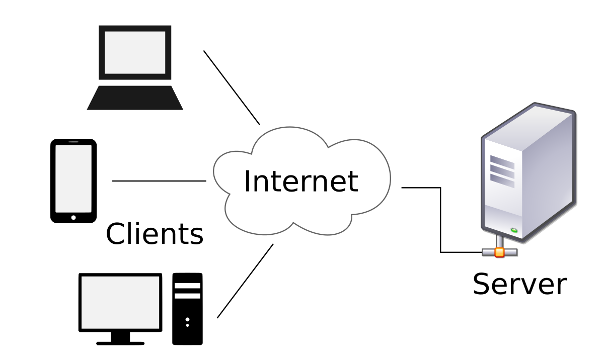
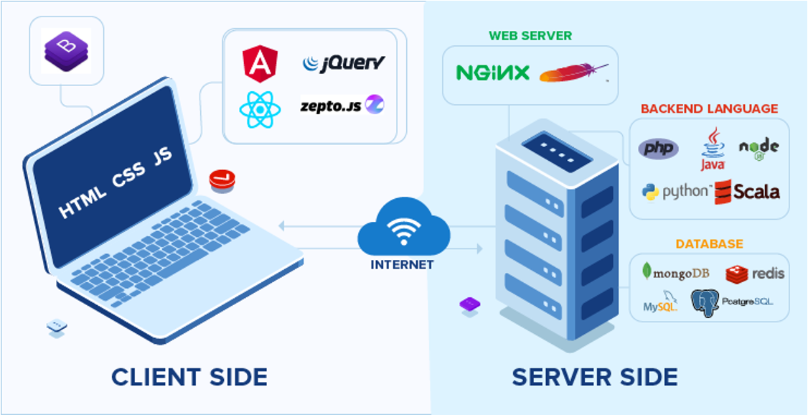
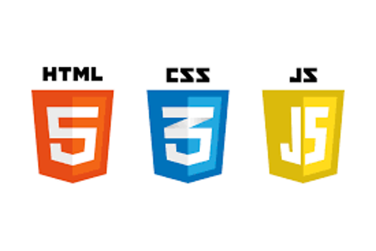
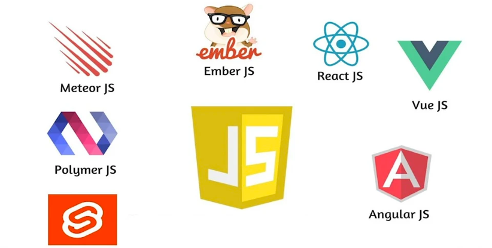
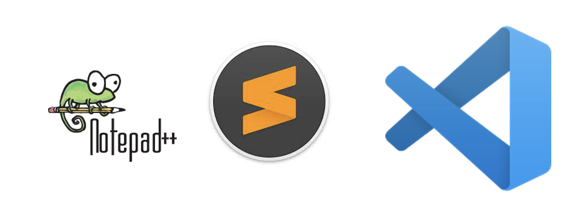
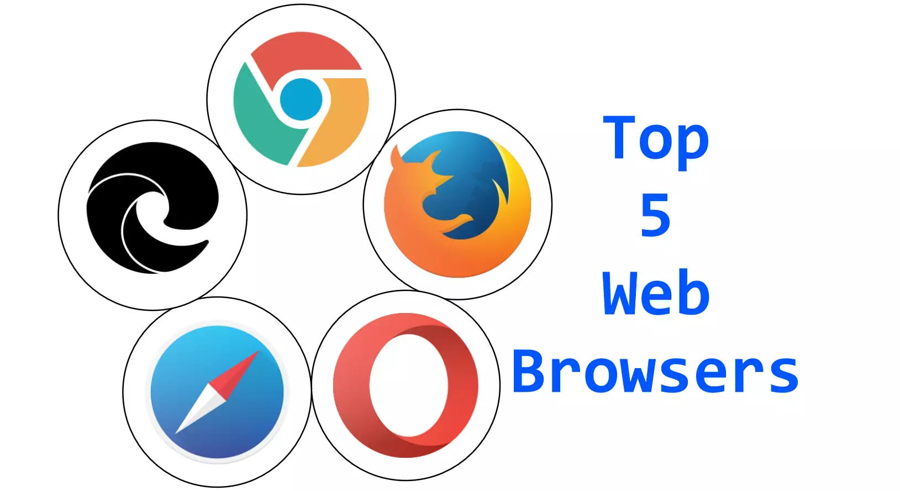
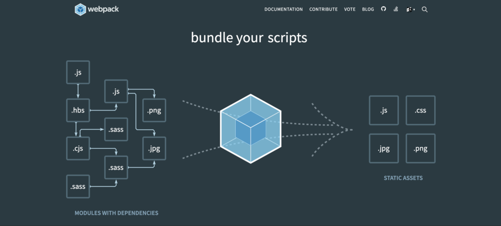
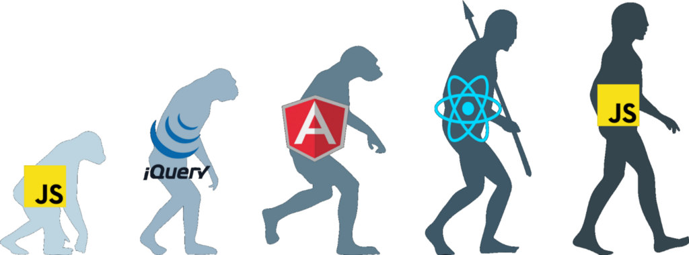

# **UNIT1 - Introduction to Frontend Tools**

## **1. Difference Between the Internet and the WWW**

#### The Internet === The WWW ??


#### The Internet:
- **Definition**: The Internet is a global network of interconnected computers and other devices. It is the infrastructure that enables various types of digital communication and data exchange.
- **History**: The development of the Internet began in the late 1960s with the creation of ARPANET, a project funded by the U.S. Department of Defense. Over the following decades, it evolved into a global network with the adoption of TCP/IP protocols in the 1980s.
- **Components**: The Internet consists of hardware (servers, routers, cables) and dertain standards and protocols (TCP/IP, Ethernet).
- **Functions**: It supports a wide range of services such as email, file transfer, instant messaging, and, of course, the World Wide Web.
- **Analogy**: Think of the Internet as the physical network of roads and highways.

#### The World Wide Web (WWW):
- **Definition**: The World Wide Web is a collection of information, accessible via the Internet, which is formatted and interlinked using hypertext and hypermedia. It is a service that operates on the Internet.
**History**: The World Wide Web was invented by Tim Berners-Lee in 1989 while working at CERN. He developed the first web browser and web server, and the first website went live in 1991. The WWW rapidly grew in popularity throughout the 1990s, becoming a major part of everyday life.
- **Components**: The WWW consists of web pages, websites, and web browsers. Web pages are documents written in HTML and accessed through URLs.
- **Functions**: It allows users to access and navigate web pages through web browsers (like Chrome, Firefox, Safari). These pages can contain text, images, videos, and links to other 

- **Analogy**: Think of the WWW as a specific system of paths and landmarks (websites and web pages) that exist on the physical roads and highways (the Internet).


#### Summary:
- **Internet**: The underlying global network connecting millions of computers.
- **WWW**: A subset of the Internet, consisting of web pages and sites, accessed through web browsers.

The WWW relies on the Internet to function, but the Internet also supports many other services beyond the Web.

## **2. Web Architecture**

The most common architecture is client/server. 
 - A **client** is a service consumer. The web browser on our device acts as a client. 
 - A **server** is one or more processes hosted on machines that provide these services."
 
 

## **3. Frontend and Backend development**

- **Backend**: The part of the web application that runs on the server.
- **Frontend**: The part of the web application that runs on the client.




### **3.1 Backend Development**

It's the development carried out on the server side. It's responsible for the business logic and data persistence (storage in the database).

Backend languajes:

- Java
- Python
- Node.js
- Ruby
- PHP
- ASP.NET


### **3.2 Frontend Development**

It's the part developed to run on the client (web browser). The web browser only knows how to interpret three languages:

- **HTML**: For the structure and content of the page
- **CSS**: Defines the appearance of the web page.
- **JavaScript**: Language that defines dynamic behavior.



Currently, it is gaining a lot of prominence due to the increased weight of web applications on the client side -> Single-page application (SPAs).

A **single-page application (SPA)** is a web application or website that interacts with the user by dynamically rewriting the current web page with new data from the web server, instead of the default method of a web browser loading entire new pages. The goal is faster transitions that make the website feel more like a native app. (Source: [Wikipedia](https://en.wikipedia.org/wiki/Single-page_application))

We can write the logic of our page in Vanilla JS. But the complexity of projects has made it necessary for various JavaScript frameworks and libraries to appear:

- Angular
- React
- Vue
- Svelte
- Many more and many more to come.
  


## **4. Javascript Languaje**

JS is an **interpreted** languaje defined as:

- **Object oriented**: JavaScript uses objects to organize and structure code, associating properties and methods with data.

- **Imperative**: JavaScript executes statements sequentially to perform tasks, focusing on how to achieve results step by step.

- **Prototype-based**: Instead of classes, JavaScript uses prototypes as templates for creating objects, allowing objects to inherit properties and methods directly from other objects.

- **Weakly typed**: JavaScript allows flexible variable types, where variables can change types during execution without explicit declarations.

- **Dynamically typed**: Types are determined at runtime in JavaScript, enabling variables to hold different types of values as the program runs, which enhances flexibility but requires careful handling to avoid unexpected behavior.

It is primarily used on the **client side**, implemented as part of the web browser to enhance the web interface and provide dynamic behavior.

It can be used also in the **server side** with **node.js** to create the backend and many other applications.

**REMINDER**
> - **Compiled Languajes**: A compiled language is a programming language where source code is translated entirely into machine code before execution, typically resulting in faster performance but requiring specific compilation for different platforms. Examples include C, C++, and Rust.
> - **Interpreted Languajes**: An interpreted language is a programming language where **the code is executed line by line by an interpreter**, translating each instruction to machine code one at a time during runtime. This approach enhances portability across different systems but typically results in slower performance compared to compiled languages. Examples include Python, JavaScript, and Ruby.

### **4.1 JS versions**

JS is a dialect of **ECMAScript** and is defined by that standard. 

**History**:

- It was created by Brendan Eich for Netscape in **1995**, initially called **LiveScript** before being renamed JavaScript. 
- In **1997**, ECMA created the **first ECMAScript standard**. 
- **ECMAScript 5**, ES5, released in **2009**, introduced many improvements and remained a standard for many years. 
- **ECMAScript 6**, also known as ES6, released in **2015**, introduced major enhancements such as the use of classes and modules. It is the most widely supported version by all current browsers.
- Since ES6, a new version has been released every year. For example, the version for 2023 is ECMAScript 14. We can check [ESCMAScript version history](https://en.wikipedia.org/wiki/ECMAScript_version_history) on Wikipedia or the [official site of ECMA](https://ecma-international.org/publications-and-standards/standards/) to check the most releases of ECMAScript.


Image source: [Gabriel Lebec @ Course Report](https://www.coursereport.com/blog/history-of-javascript)

### **4.2 TypeScript**

[TypeScript](https://www.typescriptlang.org/) is a statically typed superset of JavaScript that compiles to plain JavaScript. It is developed and maintained by Microsoft. TypeScript adds optional static types, classes, and interfaces to JavaScript, providing a robust development experience for building large-scale applications.


## **5. Tools for frontend web development**

### **5.1 Text editors**

The most important tool to code will be a good text editor. 

We can find several options in the market, from the old and reliable (but simple) Notepad++ to the very powerful VS Code.

- Notepad++
- Sublime Text
- Atom
- VS Code




We will use the most extended nowadays: [VSCode](https://code.visualstudio.com/). This powerful and handy editor from Microsoft has a lot of desiderable features as:

- Syntax highlighting
- Multiplatform: For Windows, macOS and Linux
- Support for debugging
- Built-in Git control and integration with GitHub
- Integration with GitHub Copylot. 
- "Snippets" or reusable pieces of code
- A multitude of installable extensions

**Online code editors**. They have the advantage of not having to install and configure tools on your computer. They are very useful as a sandbox (controlled environment).

- [Stackblitz](https://stackblitz.com/)
- [Code Sandbox](https://codesandbox.io/)
- [Code Pen](https://codepen.io/)

### **5.2 Web browsers**

Developers rely on browsers not only to view web pages but also for essential tools and capabilities that aid in the development and debugging process:

- **Development Tools:** Modern browsers come equipped with developer tools (like Chrome Developer Tools, Firefox Developer Tools, and Safari Web Inspector) that provide features such as:
    - DOM Inspection
    - CSS Inspection
    - Javascript console



### **5.3 **Version control tools****

Version control tools are software systems that help manage changes to files, documents, or any collection of information over time. They are essential for tracking modifications made by individuals or teams, facilitating collaboration, and ensuring the integrity and traceability of project history. The tools we will use are:

- **Git**: Git is a distributed version control system designed for speed and efficiency. It allows multiple developers to work on the same project simultaneously and offers branching and merging capabilities. This is a tool we need to install in our computer: [Git](https://git-scm.com/)


- **GitHub**: GitHub primarily functions as a hosting platform for Git repositories, so we can synchronize our local Git project to Github. But we can see all the different purposes of this tool:
    1. **Version Control**: GitHub hosts Git repositories, enabling developers to manage and track changes to their codebase over time.

    2. **Collaboration**: Facilitates teamwork by allowing multiple developers to work on the same project simultaneously, manage branches, and merge changes.

    3. **Code Hosting**: Provides a platform for developers to host and share their source code repositories, making them accessible for viewing, cloning, and contributing.

    4. **Issue Tracking**: Includes an issue tracking system for managing and resolving bugs, tasks, and feature requests related to projects.

    5. **Project Management**: Offers tools like project boards and milestones to organize tasks, track progress, and prioritize work items across teams.

    6. **CI/CD Integration**: Integrates with CI/CD tools to automate build, test, and deployment processes, ensuring code changes are tested and deployed efficiently.

    7. **Community and Open Source**: Fosters a community around open source software development, allowing users to discover, contribute to, and collaborate on projects globally.

    8. **Documentation**: Provides tools for creating and maintaining project documentation, wikis, and README files to explain project goals, usage instructions, and contribution guidelines.

**DOCUMENT DOCUMENT DOCUMENT!!!:**
> - Dont forget to document your project with a **README.md** file written in **Markdown**. Markdown is a lightweight markup language that is commonly used for formatting text on the web. When writing README files on platforms like GitHub, Markdown provides a simple and readable way to structure and style text without needing to write HTML directly.
> - Learn something about [Markdown languaje](https://www.markdownguide.org/cheat-sheet/)
> 
> - See this example -> [README.md](https://github.com/jeatzr/txt2gift/blob/main/README.md)
> 
> - Example of Markdown syntax:
> 

```
# Project Name

Description of your project.

## Installation

Instructions on how to install and run your project.

## Usage

Examples and instructions on how to use your project.

### Code Example

```javascript
console.log('Hello, World!');

```

### **5.4 Package Managers**

Package managers help us install various utilities, features, and frameworks. They streamline the process of adding, updating, and managing software packages, ensuring that we have the necessary dependencies and tools to develop and run our applications efficiently.
Popular examples are pip for Python and npm form JavaScript. 
In our case, JS,  the two main options are:

- **npm** (Node Package Manager) is the default package manager for [Node.js](https://nodejs.org/en). It helps developers install, share, and manage JavaScript libraries and dependencies for their projects. It also provides a registry where developers can publish their own packages.

- **Yarn** is an alternative package manager for JavaScript that focuses on speed, security, and reliability. Developed by Facebook, Yarn uses a lockfile to ensure consistent installations across different environments and optimizes the process of installing and updating dependencies.


### **5.5 Linters, Transpilers, and Bundlers**

**Linters** are tools that analyze your code to find and fix programming errors, bugs, stylistic errors, and other problematic patterns. They help enforce coding standards and improve code quality. Examples include:

- **ESLint**: A popular linter for JavaScript and TypeScript that helps identify and fix problems in your code.
- **JSHint**: Another JavaScript linter that detects errors and potential problems in your code.


**Transpilers** are tools that convert code written in one programming language or version into another. They are often used to translate modern JavaScript (ES6+) into older versions that are compatible with all browsers. Examples include:

- **Babel**: A widely-used JavaScript transpiler that converts ES6+ code into ES5, making it compatible with older browsers.
- **TypeScript Compiler (tsc)**: Converts TypeScript code into JavaScript, allowing developers to use TypeScript's type-checking features while still deploying JavaScript.
- **Sass**: A preprocessor scripting language that is interpreted or compiled into CSS, making it easier to write and maintain styles.


**Bundlers** are tools that combine multiple files and modules into a single file (or a few files) for easier distribution and deployment. They handle dependencies, optimize code, and often include features like code splitting and minification. Examples include:

- **Webpack**: A powerful module bundler for JavaScript applications that processes and bundles various assets like JavaScript, CSS, and images.
- **Parcel**: A fast, zero-configuration web application bundler that works out of the box with no configuration needed.
- **Rollup**: A module bundler for JavaScript that compiles small pieces of code into something larger and more complex, often used for building libraries.



These tools are essential in modern web development, helping maintain code quality, ensuring compatibility across different environments, and optimizing the final output for performance.

### **5.6 Libraries and Frameworks**

**Libraries and frameworks** extend capabilities and simplify the use of JavaScript (JS) or CSS. They provide pre-written code to perform common tasks, helping developers build applications more efficiently and with fewer errors.

- [**Bootstrap**](https://getbootstrap.com/): A CSS framework that simplifies the creation of web interface elements.
- [**jQuery**](https://jquery.com/): A JavaScript library that makes using JS easier and improves compatibility. A bit old fashioned and unnecesary, but still used in legacy websites.

#### Frameworks

- [**Angular**](https://angular.dev/): A JS framework created by Google that facilitates the creation of Single Page Applications (SPA) and follows the MVC (Model-View-Controller) pattern. It is widely used and has a large community.
- [**Vue.js**](https://vuejs.org/): An open-source JS framework also designed for creating SPAs.
- [**React**](https://react.dev/): An open-source JS library created by Facebook. It is mainly used for defining the View layer, though it can work with extensions to define more parts of the application architecture. It is also used for creating SPAs.



**Some jokes :)** [Framework war Meme](img/meme2.jpg) - [jQuery meme](img/jquery_meme.jpg) 

<div class="exercise-box">
<h3><i class="fas fa-laptop-code"></i> Hands-On Exercise 1.1</h3>
<p>Take a look on <a href="https://stateofjs.com/en-US">State Of JS</a> and comment. </p>
<p>Research different frameworks and select one that you would use to build a Single Page Application (SPA). State the reasons that convinced you.</p>
</div>

## [**6. Include JavaScript code.**](06_include_js.md)