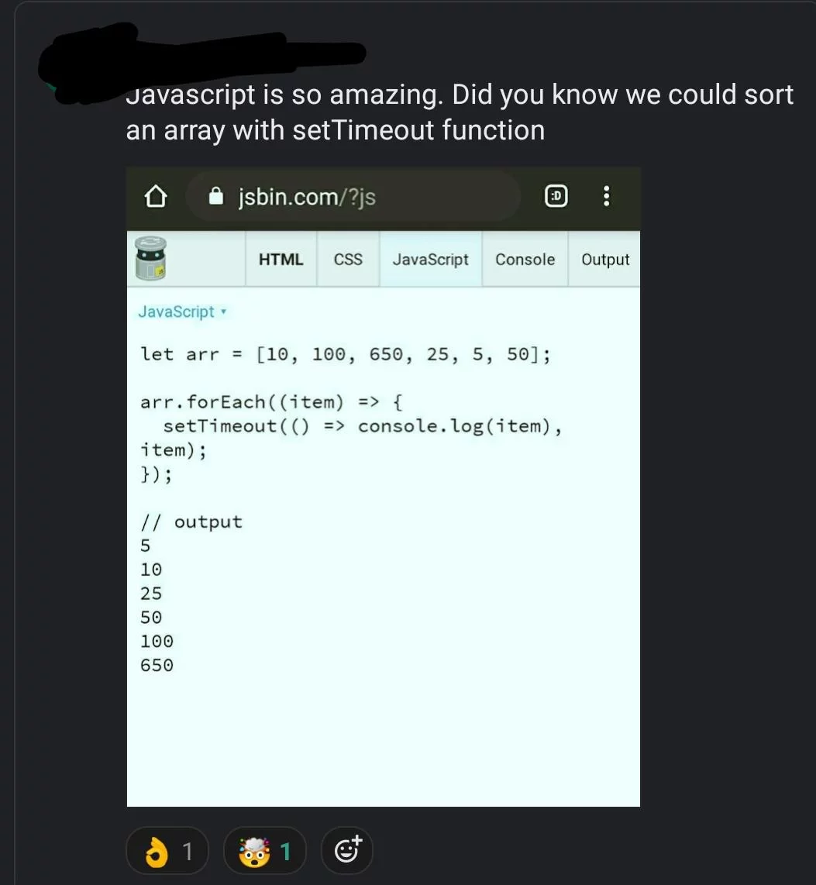

# **UNIT3 - Arrays, Objects, and Classes**

## **1. Arrays**

An Array is an ordered set of related values. Each of these values is called an element, and each element has an index indicating its numerical position in the Array. You must declare an Array before you can use it.

#### Key Points:

- **Elements**: The individual values in an array.
- **Indexes**: Numerical positions of the elements, starting from 0.
- **Declaration**: Arrays must be declared before use.

### **1.1 Declaring an Array**

In JavaScript, there are two main ways to create arrays:

1. **Using the `Array` constructor.**
2. **Using array literal notation to define the array and its items.**

#### 1. Using the `Array` constructor

```js
const a1 = new Array(); // New empty array
console.log(a1.length);

const a2 = new Array(4); // New array with 4 elements

// New array with 3 defined elements
const artist = new Array('Michael Jackson', 'Taylor Swift', 'David Bowie');

// Fill a1 new array with random values
for (let i =0; i<10; i++){
  a1[i] = Math.random();
}

// Showing length and array
console.log(a1.length)
console.log(a2.length)
console.log(artist.length)
console.log(a1)
console.log(a2)
console.log(artist)
```

#### 2. Using array literal notation

```js
const artist2 = ['Michael Jackson', 'Taylor Swift', 'David Bowie'];

// Showing length, array, and first item:
console.log(artist2.length)
console.log(artist2)
console.log(artist2[0])
```

### **1.2 Accessing Items in the Array**

You can access items in an array using their index. Array indexes start at 0, so the first element is at index 0, the second element is at index 1, and so on.

#### Example of Accessing Items:

```javascript
// Declare an array
const colors = ["Red", "Green", "Blue", "Yellow"];

// Access elements by index
console.log(colors[0]); // Output: Red
console.log(colors[1]); // Output: Green
console.log(colors[2]); // Output: Blue
console.log(colors[3]); // Output: Yellow

// Access the last element using the length property
console.log(colors[colors.length - 1]); // Output: Yellow

// Modify an element by index
colors[1] = "Purple";
console.log(colors); // Output: ["Red", "Purple", "Blue", "Yellow"]

// Loop through the array to access each element
colors.forEach(function(color, index) {
    console.log(index + ": " + color);
});
// Output:
// 0: Red
// 1: Purple
// 2: Blue
// 3: Yellow
```


### **1.3 Ways to Iterate Over an Array**

In JavaScript, there are several ways to iterate over an array. Here are some of the most common methods:

1. **Traditional `for` Loop**
2. **`for...of` Loop**
3. **`for...in` Loop**
4. **`forEach` Method**

#### 1. Traditional `for` Loop

The traditional `for` loop is the most basic and flexible way to iterate over an array.

```javascript
const fruits = ["Apple", "Banana", "Cherry", "Date"];

for (let i = 0; i < fruits.length; i++) {
    console.log(fruits[i]);
}
// Output:
// Apple
// Banana
// Cherry
// Date
```

#### 2. `for...of` Loop
The for...of loop is used to iterate over the values of an array.
```js
for (const fruit of fruits) {
    console.log(fruit);
}
// Output:
// Apple
// Banana
// Cherry
// Date
```

#### 3. `for...in` Loop

The for...in loop is used to iterate over the enumerable properties of an object, but it can also be used to iterate over the indices of an array (not recommended for arrays).

```js
for (const index in fruits) {
    console.log(fruits[index]);
}
// Output:
// Apple
// Banana
// Cherry
// Date
```

#### 4. `forEach` Method

The forEach method executes a provided callback function once for each array element.

This is the most used method to iterate over arrays.

```js
fruits.forEach((fruit, index) => {
    console.log(index + ": " + fruit);
});
// Output:
// 0: Apple
// 1: Banana
// 2: Cherry
// 3: Date
```


### **1.4 Array Properties**

Arrays in JavaScript come with several built-in properties that provide useful information and functionality. Here are two of the most important properties:

#### 1. `length`

The `length` property of an array returns the number of elements in the array.

```javascript
const fruits = ["Apple", "Banana", "Cherry"];
console.log(fruits.length); // Output: 3
```

#### 2. `prototype`

The `prototype` property allows you to add new properties and methods to all array objects.

```js
Array.prototype.first = function() {
    return this[0];
};

console.log(fruits.first()); // Output: Apple
```

### **1.5 Array Important Methods**

JavaScript arrays come with a variety of built-in methods that provide powerful functionalities for manipulating and interacting with array elements. Here are some of the most important methods:


1. [`push`](#1-push)
2. [`pop`](#2-pop)
3. [`shift`](#3-shift)
4. [`unshift`](#4-unshift)
5. [`concat`](#5-concat)
6. [`slice`](#6-slice)
7. [`splice`](#7-splice)
8. [`indexOf`](#8-indexof)
9.  [`includes`](#9-includes)
10. [`forEach`](#10-foreach)
11. [`map`](#11-map)
12. [`filter`](#12-filter)
13. [`reduce`](#13-reduce)
14. [`sort`](#14-sort)

#### 1. `push`

Adds one or more elements to the end of an array and returns the new length of the array.

```javascript
const fruits = ["Apple", "Banana"];
fruits.push("Cherry");
console.log(fruits); // Output: ["Apple", "Banana", "Cherry"]
```
#### 2. `pop`

Removes the last element from an array and returns that element.

```js
const lastFruit = fruits.pop();
console.log(lastFruit); // Output: Cherry
console.log(fruits); // Output: ["Apple", "Banana"]
```

#### 3. `shift` 

Removes the first element from an array and returns that element.

```javascript
const firstFruit = fruits.shift();
console.log(firstFruit); // Output: Apple
console.log(fruits); // Output: ["Banana"]
```

#### 4. `unshift`

Adds one or more elements to the beginning of an array and returns the new length of the array.

```javascript
fruits.unshift("Apple");
console.log(fruits); // Output: ["Apple", "Banana"]
```

#### 5. `concat`

Merges two or more arrays and returns a new array.

```javascript
const moreFruits = ["Cherry", "Date"];
const allFruits = fruits.concat(moreFruits);
console.log(allFruits); // Output: ["Apple", "Banana", "Cherry", "Date"]
```

#### 6. `slice`

Returns a shallow copy of a portion of an array into a new array object. 

```javascript
const someFruits = allFruits.slice(1, 3);
console.log(someFruits); // Output: ["Banana", "Cherry"]
```
The last index is not included. In the example we take from index 1 to index 3 (not included).

#### 7. `splice`

Changes the contents of an array by removing or replacing existing elements and/or adding new elements.

```javascript
allFruits.splice(2, 1, "Blueberry");
console.log(allFruits); // Output: ["Apple", "Banana", "Blueberry", "Date"]
```

#### 8. `indexOf`

Returns the first index at which a given element can be found in the array, or -1 if it is not present.

```javascript
const index = allFruits.indexOf("Banana");
console.log(index); // Output: 1
```

#### 9. `includes`

Determines whether an array includes a certain element, returning true or false.

```javascript
const hasBanana = allFruits.includes("Banana");
console.log(hasBanana); // Output: true
```

#### 10. `forEach`
Executes a provided function once for each array element.


```javascript
allFruits.forEach(function(fruit, index) {
    console.log(index + ": " + fruit);
});
// Output:
// 0: Apple
// 1: Banana
// 2: Blueberry
// 3: Date

```

#### 11. `map`

Creates a new array with the results of calling a provided function on every element in the calling array.

```javascript
const upperCaseFruits = allFruits.map(function(fruit) {
    return fruit.toUpperCase();
});
console.log(upperCaseFruits); // Output: ["APPLE", "BANANA", "BLUEBERRY", "DATE"]
```

#### 12. `filter`

Creates a new array with all elements that pass the test implemented by the provided function.

```javascript
const longNamedFruits = allFruits.filter(function(fruit) {
    return fruit.length > 5;
});
console.log(longNamedFruits); // Output: ["Blueberry"]
```

#### 13. `reduce`

Executes a reducer function on each element of the array, resulting in a single output value.

```javascript
const totalLength = allFruits.reduce(function(accumulator, fruit) {
    return accumulator + fruit.length;
}, 0);
console.log(totalLength); // Output: 26
```
#### 14. `sort`

It is used to sort the elements of an array in place and returns the sorted array. When no compare function is provided, sort() converts each element to a string and sorts them lexicographically (dictionary order).

  - Sorting without a Compare Function
      ```js
      const fruits = ['banana', 'apple', 'orange'];
      fruits.sort();
      console.log(fruits); // ["apple", "banana", "orange"]
      ```

  - Sorting with a Compare Function
      ```js
      const numbers = [4, 2, 5, 1, 3];
      numbers.sort((a, b) => a - b);
      console.log(numbers); // [1, 2, 3, 4, 5]
      ```
  
  Source: [@mdn web docs_](https://developer.mozilla.org/en-US/docs/Web/JavaScript/Reference/Global_Objects/Array/sort)

#### Boom!



<div class="exercise-box">
  <h3><i class="fas fa-laptop-code"></i> Hands-On Exercise: Array Manipulation with `map`</h3>
  <p>Create a web page that calculates the square of each number in an array and displays the results.</p>
  
  <script>
    // Array of numbers
    const numbers = [1, 2, 3, 4, 5];

    // Using the map function to calculate squares
    const squares = numbers.map(function(number) {
      return number * number;
    });

    // Displaying the results
    document.write("<p>Original Numbers: " + numbers.join(", ") + "</p>");
    document.write("<p>Squares: " + squares.join(", ") + "</p>");
  </script>
</div>


## **2. Objects**

JavaScript is designed on a simple object-based paradigm. An object is a collection of properties, where a property is an association between a name (or key) and a value. 

The value of a property can be a function, in which case the property is known as a method. 

In addition to the objects that are predefined in the browser, you can define your own objects.

Source: [https://developer.mozilla.org/en-US/docs/Web/JavaScript/Guide/Working_with_objects](https://developer.mozilla.org/en-US/docs/Web/JavaScript/Guide/Working_with_objects)

#### Key Points:

- **Properties**: Associations between a name (key) and a value.
- **Methods**: Functions that are properties of objects.
- **Custom Objects**: User-defined objects in addition to browser-defined objects.

### **2.1 Declaring Objects**

In JavaScript, there are two main ways to create objects:

1. **Using the `Object` constructor and then adding properties.**
2. **Using object literal notation to define the object and its properties directly.**

#### 1. Using the `Object` Constructor

You can create an empty object using the `Object` constructor and then add properties to it.

```javascript
// Create an empty object using the Object constructor
const myCar = new Object();

// Add properties to the object
myCar.make = "Ford";
myCar.model = "Mustang";
myCar.year = 1969;

// Access properties
console.log(`Make: ${myCar.Make} Model: ${myCar.model}`);
```

#### 2. Using object literal notation

You can define the object and its properties directly using object literal notation, which is more concise and easier to read.

```javascript
// Create an object with literal notation
const myCar2 = {
  make: 'Seat',
  model: '600',
  year: '1965'
}

// Access properties
console.log(`Make: ${myCar2.Make} Model: ${myCar2.model}`);
```

#### Creating an object with methods:

```js
// Define an object using object literal notation
const person = {
    firstName: "John",
    lastName: "Doe",
    age: 30,
    // this is a method:
    greet: function() {
        console.log("Hello, " + this.firstName + " " + this.lastName);
    }
};

// Access properties and call the method
console.log(person.firstName); // Output: John
// Calling the method
person.greet(); // Output: Hello, John Doe
```

### **2.2 Constructor Functions and Object Instances**

In JavaScript, you can create a constructor function to define the structure and behavior of objects. Then, you can create instances of the object using the `new` keyword.

```javascript
// Define a constructor function
function Person(firstName, lastName, age) {
    this.firstName = firstName;
    this.lastName = lastName;
    this.age = age;
    this.greet = function() {
        console.log("Hello, " + this.firstName + " " + this.lastName);
    };
}

// Create instances of the Person object
const person1 = new Person("John", "Doe", 30);
const person2 = new Person("Jane", "Smith", 25);

// Access properties and call methods
console.log(person1.firstName); // Output: John
person1.greet(); // Output: Hello, John Doe

console.log(person2.firstName); // Output: Jane
person2.greet(); // Output: Hello, Jane Smith
```

## **3. Classes in JavaScript**

Since ES6 (ECMAScript 2015), JavaScript supports class syntax, allowing for a more traditional object-oriented programming style. Here are some key features of ES6 classes:

#### Class Declaration with Constructor

Classes in JavaScript can have a `constructor` method, which is a special method for initializing instances of the class with certain properties.

```javascript
class Car {
  constructor(brand, model) {
    this.brand = brand;
    this.model = model;
    this.mileage = 0;
  }
}
```

#### Setter and Getter Methods

ES6 classes also support setter and getter methods using the `set` and `get` keywords, respectively, allowing controlled access to object properties.
We can have regular methods also.

```javascript
class Car {
  constructor(brand, model) {
    this._brand = brand;
    this._model = model;
    this._mileage = 0;
  }

  // Regular method
  drive(distance) {
    this.mileage += distance;
    console.log(`Driving ${distance} miles in ${this.brand} ${this.model}.`);
  }

  // Getter method
  get mileage() {
    return this._mileage;
  }

  // Setter method
  set mileage(value) {
    if (value >= 0) {
      this._mileage = value;
    } else {
      console.error("Mileage cannot be negative.");
    }
  }
}

// Create an instance of Car
const myCar = new Car("Toyota", "Corolla");

// Call regular method to drive
myCar.drive(50);
myCar.drive(30);

// Access mileage using getter method
console.log(`Total mileage: ${myCar.mileage} miles.`);
```

## **4. Arrays of objects**

In JavaScript, arrays can hold a collection of objects. Each object within the array can have its own properties and methods, allowing for structured data organization and manipulation.

```js
// Define an array of objects (array of cars)
let cars = [
  { brand: "Toyota", model: "Corolla", year: 2020 },
  { brand: "Honda", model: "Civic", year: 2019 },
  { brand: "Ford", model: "Mustang", year: 2021 }
];

// Accessing objects in the array
console.log(cars[0]); // Output: { brand: "Toyota", model: "Corolla", year: 2020 }

// Adding a new object to the array
cars.push({ brand: "Tesla", model: "Model S", year: 2022 });

// Modifying an object in the array
cars[1].year = 2020;

// Removing an object from the array
cars.splice(2, 1); // Removes the object at index 2

// Iterating over the array of objects
cars.forEach(function(car) {
  console.log(`${car.brand} ${car.model} (${car.year})`);
});
```

## **5. JSON Notation**

#### Do you know Jason?


**JSON (JavaScript Object Notation) **is a lightweight data-interchange format that is easy for humans to read and write, and easy for machines to parse and generate. It is widely used as a format for exchanging data between a server and a web application, and is a standard data format with many programming languages.

#### Syntax

- **Data is in name/value pairs**: JSON data is represented as key-value pairs.
- **Data is separated by commas**: JSON data is separated by commas.
- **Curly braces hold objects**: JSON data is enclosed in curly braces `{}` to denote objects.
- **Square brackets hold arrays**: JSON arrays are enclosed in square brackets `[]`.

```json
{
  "firstName": "John",
  "lastName": "Doe",
  "age": 30,
  "isStudent": false,
  "address": {
    "streetAddress": "123 Main Street",
    "city": "Anytown",
    "state": "CA",
    "postalCode": "12345"
  },
  "phoneNumbers": [
    { "type": "home", "number": "555-1234" },
    { "type": "work", "number": "555-5678" }
  ]
}
```

#### Key Points
  - **Data Types:**JSON supports strings, numbers, objects, arrays, booleans, and null values.
  - **Universal Format:** JSON is independent of programming languages, making it suitable for data exchange.
  - **Parsing:** JSON can be parsed into JavaScript objects using JSON.parse() and converted back to JSON using JSON.stringify().

#### Usage 
  - **Web APIs:** Many web APIs use JSON to send data between servers and web browsers.
  - **Configuration Files:** JSON is used in configuration files due to its human-readable format.
  - **Data Storage:** JSON is used for storing and exchanging structured data in databases and applications.

#### Parsing an object to JSON ready to send or store. And vice-versa.

```js
// Object with multiple attributes, including an array of objects
let user = {
  name: "John Doe",
  age: 35,
  address: {
    street: "Main Street",
    city: "New York",
    country: "USA"
  },
  orderHistory: [
    { id: 1, product: "Smartphone", quantity: 1 },
    { id: 2, product: "Tablet", quantity: 2 },
    { id: 3, product: "Laptop", quantity: 1 }
  ]
};

// Convert to JSON using JSON.stringify()
let jsonUser = JSON.stringify(user);

console.log("Object converted to JSON:");
console.log(jsonUser);

// Convert back to object using JSON.parse()
let parsedObject = JSON.parse(jsonUser);

console.log("\nJSON converted back to object:");
console.log(parsedObject);
```

