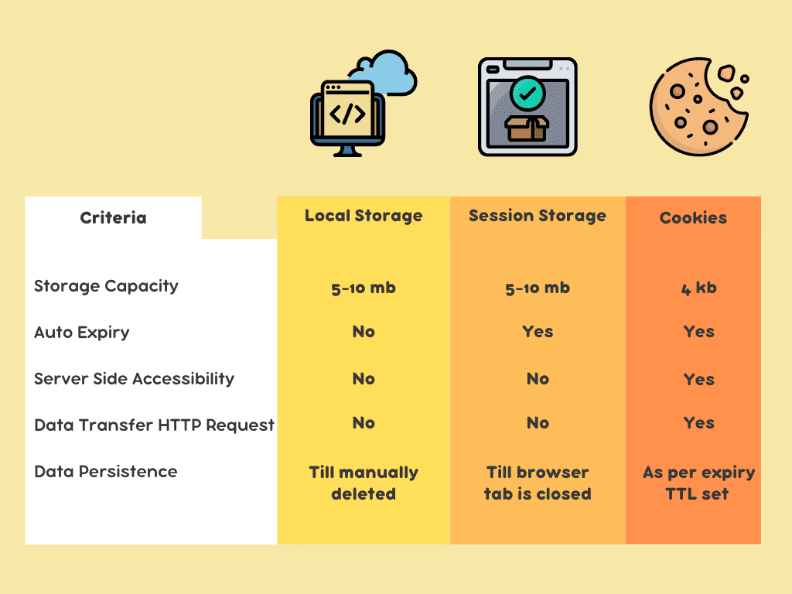
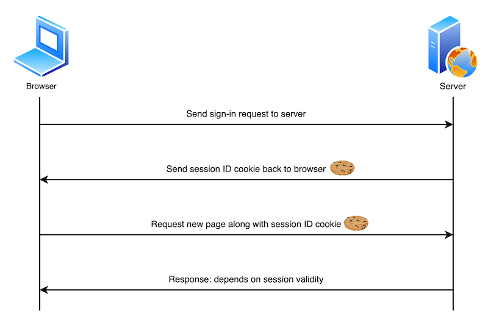

# **UNIT7 - Client-Side Storage**

## 1. **Introduction**

Client storage refers to the various methods that allow web applications to store data on the client-side, within the user's browser. This enables web applications to save and retrieve data without requiring constant communication with the server. Client storage enhances user experience by providing faster access to data and reducing server load.

### 1.1 **Uses**

Client storage can be utilized for a variety of purposes, including:

- **Storing User Preferences**: Save settings and preferences for a personalized user experience.
- **Tracking**: Recording and analyzing user behavior.
- **Offline Access**: Allow users to access and interact with web applications even when offline.
- **Session Management**: Maintain user session information to keep users logged in or remember their progress in a task.
- **Caching Data**: Store frequently accessed data to improve performance and reduce server requests.
- **Temporary Data Storage**: Hold data temporarily during a user's interaction with the web application, such as form inputs or temporary files.

### 1.2 **Methods**

- **Cookies (old school method)**: Small pieces of data stored in the browser and sent to the server with every HTTP request. Commonly used for session management and user preferences.

- **Local Storage**: Key-value storage that allows data to be stored persistently in the browser without an expiration date. Ideal for saving settings and application data that do not need to be sent to the server.

- **Session Storage**: Similar to Local Storage, but data is only stored for the duration of the page session. Useful for temporary data that only needs to be accessible while the page is open.

- **IndexedDB**: A NoSQL database that allows for storing large amounts of structured data. Suitable for complex applications that require significant local data storage and offline capabilities.



Image Source:  [Local Storage vs. Session Storage vs. Cookies @ LoginRadius](https://www.loginradius.com/blog/engineering/guest-post/local-storage-vs-session-storage-vs-cookies/)

## 2. **Cookies**

- Small pieces of data stored in the browser and sent to the server with every HTTP request. 
- Commonly used for session management, user tracking and user preferences.
- Advantages:
    - Automatic sending with HTTP requests.
    - Universal browser support.
    - Server-side control over setting, modifying, and deleting cookies.
    - Configurable expiration and scope.



**Source:** [mdn web docs_](https://developer.mozilla.org/en-US/docs/Web/HTTP/Cookies)

### 2.1 **Types of Cookies**

- **Session Cookies**:
      - These cookies are temporary and are deleted once the browser is closed.
      - Commonly used to store session data that only needs to persist during a single browsing session.

- **Persistent Cookies**:
      - These cookies remain on the user's device for a set period or until they are manually deleted.
      - Used for storing user preferences, login information, and other settings that need to persist between sessions.

### 2.2 **Writing Cookies**

To write cookies using JavaScript, you can use the `document.cookie` property. Here’s how you can set both session and persistent cookies:

#### Setting a Session Cookie

Session cookies do not have an expiration date, so they expire once the browser is closed.

```js
document.cookie = "username=JohnDoe";
```

#### Setting a Persistent Cookie

Persistent cookies have an expiration date and remain on the user's device until the specified date or until they are manually deleted.

```js
// Set a cookie with an expiration date
const now = new Date();
const time = now.getTime();
const expireTime = time + (7 * 24 * 60 * 60 * 1000); // 7 days from now
now.setTime(expireTime);

document.cookie = `username=JohnDoe; expires=${now.toUTCString()}; path=/`;
```

#### Cookie Parameters

When setting cookies, you can specify additional parameters:

- **expires**: Sets the expiration date for the cookie.
- **path**: Defines the URL path where the cookie is accessible.
- **domain**: Specifies the domain for which the cookie is valid.
- **secure**: Ensures the cookie is sent over HTTPS only.
- **SameSite**: Controls whether cookies are sent with cross-site requests.

Example with all parameters:

```js
const now = new Date();
now.setTime(now.getTime() + (30 * 24 * 60 * 60 * 1000)); // 30 days from now

document.cookie = "username=JohnDoe; expires=" + now.toUTCString() + "; path=/; domain=example.com; secure; SameSite=Strict";
```


#### Generic JavaScript function for setting a cookie

```js
function setCookie(name, value, days = null, path = "/") {
    let cookieString = `${name}=${value}; path=${path};`;
    
    if (days) {
        const date = new Date();
        date.setTime(date.getTime() + (days * 24 * 60 * 60 * 1000));
        const expires = date.toUTCString();
        cookieString += ` expires=${expires};`;
    }
    
    document.cookie = cookieString;
}

// Usage examples
setCookie("username", "JohnDoe"); // Session cookie
setCookie("username", "JohnDoe", 7); // Persistent cookie for 7 days
setCookie("username", "JohnDoe", 7, "/user"); // Persistent cookie for 7 days with path /user
```

#### Inspecting Cookie Values

To inspect cookie values in Chrome DevTools, follow these steps:

1. Right-click on the webpage and select `Inspect`.
2. Navigate to the `Application` tab.
3. Under the `Storage` section, select `Cookies`.
4. Choose the appropriate server from the list.
5. View the cookies in the main section.


### 2.2 **Reading Cookies**

You can read cookies by accessing `document.cookie`, which returns a string containing all cookies.

```js
const cookies = document.cookie.split("; ");
cookies.forEach(cookie => {
  const [name, value] = cookie.split("=");
  console.log(`${name}: ${value}`);
});
```

We can create a function to read a specific cookie based on its name:

```js
function getCookie(name) {
    // Helper function to decode cookie value
    function decodeCookie(value) {
        return decodeURIComponent(value.replace(/\+/g, ' '));
    }

    // Get all cookies from document.cookie
    const cookies = document.cookie.split('; ').reduce((acc, cookie) => {
        const [cookieName, cookieValue] = cookie.split('=');
        acc[cookieName] = decodeCookie(cookieValue);
        return acc;
    }, {});

    // Find the cookie with the matching name
    return cookies[name] || null;
}

// Usage example
const cookieValue = getCookie('myCookieName');
console.log(cookieValue);
```

**Key points**

1. `document.cookie`: Contains all cookies as a single string in the format `"name1=value1; name2=value2; ..."`.
2. `split('; ')`: Splits this string into individual cookies.
3. `reduce`: Transforms the cookies into an object where the keys are cookie names and the values are cookie values.
4. `decodeURIComponent`: Decodes any special characters in the cookie values.

### 2.4 **Erasing Cookies**

To delete a cookie, set its expiration date to a past date.

```js
document.cookie = "username=; expires=Thu, 01 Jan 1970 00:00:00 UTC;";
```

We can create a generic function to erase a cookie with a given name. 
This function uses `setCookie`function with property `days = -1`, that is referring to a past date.

```js
function eraseCookie(name){
  setCookie(name,"",-1)
}
```

## 3. **Web Storage API**

`Local storage` and `session storage` are both part of the `Web Storage API`, providing ways for web applications to store data locally within the user's browser. While they have some similarities, they also have distinct differences:

- **localStorage**: Data persists even after the browser is closed. It can be accessed in the read-only property [`localStorage`](https://developer.mozilla.org/en-US/docs/Web/API/Window/localStorage).
- **sessionStorage**: Data stored in session storage is cleared when the page session ends. It can be accessed in the read-only property [`sessionStorage`](https://developer.mozilla.org/en-US/docs/Web/API/Window/sessionStorage).

The methods to access `localStorage` and `sessionStorage` items are exactly the same:

**`localStorage` Methods**

```js
// Set local storage item
localStorage.setItem("myCenter", "IES Azarquiel");

// Get local storage item
const center = localStorage.getItem("myCenter");

// Delete local storage item
localStorage.removeItem("myCenter");

// Remove all saved data from localStorage
localStorage.clear();
``` 

**`sessionStorage` Methods**

```js
// Set session storage item
sessionStorage.setItem("sessionValue", "My Value");

// Get session storage item
const value = sessionlStorage.getItem("sessionValue");

// Delete session storage item
sessionStorage.removeItem("sessionValue");

// Remove all saved data from sessionStorage
sessionStorage.clear();
``` 


### 3.1 **Local Storage Example Uses**

#### Storing User Preferences

A website can remember user settings, such as theme (dark/light mode), language preferences, or font size, without needing a backend database.

```js
// Save preference
localStorage.setItem('theme', 'dark');

// Retrieve preference
const theme = localStorage.getItem('theme');
console.log(theme); // Outputs: dark
```

**Check this!** -> [How to manage Dark Mode in CSS](https://css-tricks.com/a-complete-guide-to-dark-mode-on-the-web/)


#### Saving Form Data:

Local storage can be used to save form data temporarily, allowing users to leave the page and come back without losing their progress.

```js
// Save form data
localStorage.setItem('formData', JSON.stringify({ name: 'John', email: 'john@example.com' }));

// Retrieve form data
const formData = JSON.parse(localStorage.getItem('formData'));
console.log(formData); // Outputs: { name: 'John', email: 'john@example.com' }
```

#### Caching API Responses:

For applications that fetch data from APIs, local storage can be used to cache responses and reduce the number of API calls, improving performance and user experience.

```js
// Save API response
localStorage.setItem('apiResponse', JSON.stringify(responseData));

// Retrieve API response
const cachedData = JSON.parse(localStorage.getItem('apiResponse'));
console.log(cachedData); // Outputs: responseData
```

#### Maintaining State Across Page Loads:

Web applications can maintain user state, such as items in a shopping cart or the last viewed page, across page loads.

```js
// Save state
let appState = [{ id: 1, name: 'Product A' }, { id: 2, name: 'Product B' }]
localStorage.setItem('cartItems', JSON.stringify(state));

// Retrieve state
const cartItems = JSON.parse(localStorage.getItem('cartItems'));
console.log(cartItems); // Outputs: [{ id: 1, name: 'Product A' }, { id: 2, name: 'Product B' }]
```

### 3.2. **Session Storage Example Uses**

**Storing Temporary Data:**

Ideal for data that is only relevant for the duration of the page session, such as a multi-step form process.

```js
// Save form step data
sessionStorage.setItem('currentStep', '2');

// Retrieve form step data
const currentStep = sessionStorage.getItem('currentStep');
console.log(currentStep); // Outputs: 2
```

**Maintaining User State Within a Single Session:**

Useful for keeping track of user interactions on a single-page application (SPA) without impacting other tabs or future sessions.

```js
// Save user interaction state
sessionStorage.setItem('isLoggedIn', 'true');

// Retrieve user interaction state
const isLoggedIn = sessionStorage.getItem('isLoggedIn');
console.log(isLoggedIn); // Outputs: true
```

**Storing Temporary UI State**:

Can be used to store the UI state temporarily, such as whether a modal was open or closed.

```js 
// Save UI state
sessionStorage.setItem('isModalOpen', 'true');

// Retrieve UI state
const isModalOpen = sessionStorage.getItem('isModalOpen');
console.log(isModalOpen); // Outputs: true
```

**Saving text between refreshes**

The following example autosaves the contents of a text field, and if the browser is refreshed, restores the text field content so that no writing is lost.

```js
// Get the text field that we're going to track
let field = document.getElementById("field");

// See if we have an autosave value
// (this will only happen if the page is accidentally refreshed)
if (sessionStorage.getItem("autosave")) {
  // Restore the contents of the text field
  field.value = sessionStorage.getItem("autosave");
}

// Listen for changes in the text field
field.addEventListener("change", () => {
  // And save the results into the session storage object
  sessionStorage.setItem("autosave", field.value);
});
```
Source of the example: [mdn web docs_](https://developer.mozilla.org/en-US/docs/Web/API/Window/sessionStorage)

Another example: [Using the Web Storage API](https://developer.mozilla.org/en-US/docs/Web/API/Web_Storage_API/Using_the_Web_Storage_API)